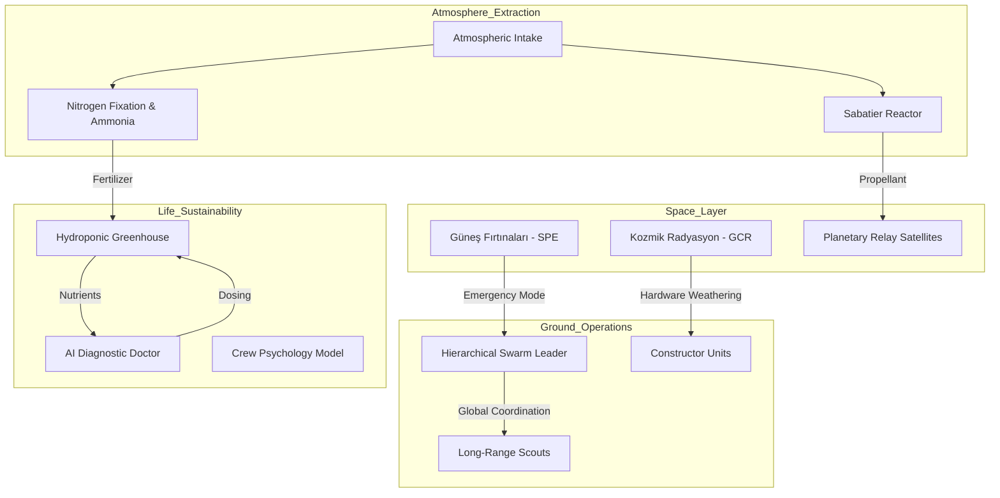

# ?? RedPlanet: Küresel Mars Habitatı ve Gezegensel Dayanıklılık El Kitabı

## ?? Giriş ve Vizyon
**RedPlanet v5.0**, Mars'ta sürdürülebilir bir medeniyet kurmanın mühendislik, lojistik ve biyolojik zorluklarını simüle eden, "Küresel Dayanıklılık" (Planetary Resilience) odaklı nihai el kitabıdır. Bu proje, bir başlangıç kodundan; kimyasal egemenlik, robotik hiyerarşi ve radyasyon koruması sağlayan devasa bir otonom sisteme dönüşmüştür.

---

## ?? Gezegensel Operasyon Mimarisi

---

## ?? Teknik Referans ve Formülasyonlar

### 1. Kimyasal Egemenlik (ISRU & Nitrogen Fixation)
v5.0 ile atmosferik Azot ($N_2$) ayrıştırılarak tarımsal verimlilik için **Amonyak ($NH_3$)** sentezlenir.
- **Haber-Bosch Sentezi:** $N_2 + 3H_2 \rightleftharpoons 2NH_3$ (Eknotermik, $\eta \sim 15\%$)

### 2. Robotik Hiyerarşi (Hierarchical Command)
Otonom araçlar artık bireysel değil, hiyerarşik bir sürü olarak hareket eder.
- **FSPL Latency:** Sinyal kaybı mesafenin karesiyle orantılı olarak modellenir:
  $$L_{fs} (dB) = 20 \log_{10}(d) + 20 \log_{10}(f) + 92.45$$

### 3. Radyasyon ve Donanım Yıpranması
Kozmik radyasyonun güneş panelleri ve rover devreleri üzerindeki kümülatif etkisi:
- **Weathering Rate:** $Health_{hw} = 1.0 - (\int D_{rad} \, dt \cdot 10^{-6})$

---

## ?? API Referans Mimarisi

### `isru_simulator`
| Fonksiyon | Açıklama |
| :--- | :--- |
| `calculate_full_isru_cycle` | Yakıt, Oksijen, Metal ve Amonyak üretimini optimize eder. |
| `extract_metals_from_regolith` | MSE (Molten Salt Electrolysis) ile Fe/Al üretir. |
| `synthesize_ammonia` | Atmosferik N2'den gübre sentezler. |

### `swarm_construction`
| Modül | Görevi |
| :--- | :--- |
| `hierarchical_swarm` | Lider-takipçi dinamiklerini yönetir. |
| `self_repair` | Rover bileşenlerinin otonom onarımını simüle eder. |
| `relay_comm` | Uzun mesafeli sinyal kaybı ve latency hesaplar. |

### `eclss_energy_manager`
| Sınıf | Parametreler |
| :--- | :--- |
| `HydroponicGreenhouse` | Biyolojik O2 ve besin üretimi. |
| `RadiationModel` | Kümülatif doz ve donanım sağlığı takibi. |
| `HealthAIPredictor` | Mürettebat sağlığı ve trend analizi. |

---

## ?? Gelecek Stratejisi (Mission v6.0 - v10.0)
- **v6.0:** Mars-Dünya Quantum Relay sistemleri.
- **v10.0:** Terraforming öncüleri ve okyanus oluşum simülasyonları.

---

## ?? Geliştirici Ekibi ve Bilimsel Standartlar
Bu proje **NASA TRL-9** ve **ESA Planetary Protection** standartları gözetilerek "Planetary Resilience" vizyonu ile geliştirilmiştir.

**Milli Uzay Programı Vizyonuyla Mars Geleceğine Hazırız.**
© 2026 RedPlanet Global Systems.