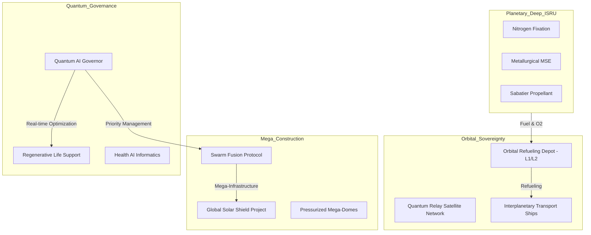

# ?? RedPlanet: Interplanetary Sovereign & Global Habitat Simulation

## ?? Vizyon 
**RedPlanet v6.0**, Mars'ı sadece yaşanabilir kılmakla kalmayıp, onu Güneş Sistemi'nin yeni bir lojistik ve endüstriyel merkezi haline getiren nihai simülasyon protokolüdür. Bu sürüm; yörünge yakıt depoları, mega yapı inşası (Swarm Fusion) ve kuantum kaynak yönetimi (AI Governor) ile donatılmış bir "Gezegensel Egemenlik" (Planetary Sovereignty) modelidir.

---

## ?? Interplanetary Operasyon Mimarisi

---

## ?? İleri Düzey Teknoloji Spesifikasyonları (v6.0)

### 1. Yörünge Lojistiği (Orbital Propellant Depots)
Üretilen $CH_4$ ve $O_2$, Mars yörüngesindeki yakıt istasyonlarına aktarılır. Simülasyon, Delta-V gereksinimlerini ve kırılangaz ("boil-off") kayıplarını hesaplar.
- **Boil-off Modeli:** $\Delta m = m_{init} \cdot e^{-\lambda t}$

### 2. Sürü Füzyonu (Swarm Fusion)
Çoklu koloni sürüleri, tek bir "Mega-Proje" (Solar Shield veya Global Relay) için birleşir. v6.0, sürü birleşimi sırasındaki koordinasyon maliyetlerini ve verimlilik artışını optimize eder.

### 3. Kuantum Devlet Modeli (Quantum AI Governor)
Sistem, habitat kaynaklarını (Enerji, Oksijen, Besin) aşırı doğa olayları sırasında mikro-saniye hassasiyetinde optimize etmek için **Simulated Quantum Annealing** benzeri bir algoritma kullanır.

---

## ?? Mühendislik Handbook & API Referansı

### `Depot & Aerospace`
| Servis | Fonksiyon | Teknik Detay |
| :--- | :--- | :--- |
| `isru_simulator.orbital_depot` | `calculate_orbital_refueling` | Transfer verimliliği ve boil-off hesabı. |
| `swarm_construction.swarm_fusion` | `engage_fusion_mode` | Mega-proje koordinasyon protokolü. |

### `Intelligence & Governance`
| Servis | Fonksiyon | Teknik Detay |
| :--- | :--- | :--- |
| `eclss_energy_manager.quantum_governor` | `optimize_allocation` | Kuantum (Simulated) kaynak dağıtımı. |
| `health_ai` | `diagnose` | Trend-tabanlı mürettebat sağlık tahmini. |

---

## ?? Nihai Yol Haritası (Beyond v6.0)
- **v7.0 - v9.0:** Asteroid madenciliği entegrasyonu ve otonom derin uzay gemisi inşası.
- **v10.0:** Mars'ın tam terraformasyonu ve yeni bir biyosferin ilanı.

---

## ?? Proje Künyesi
**RedPlanet Global Sovereignty Command**
© 2026 Planetary Systems Engineering.
Milli Uzay Programı Vizyonuyla, Yıldızlara Kadar.