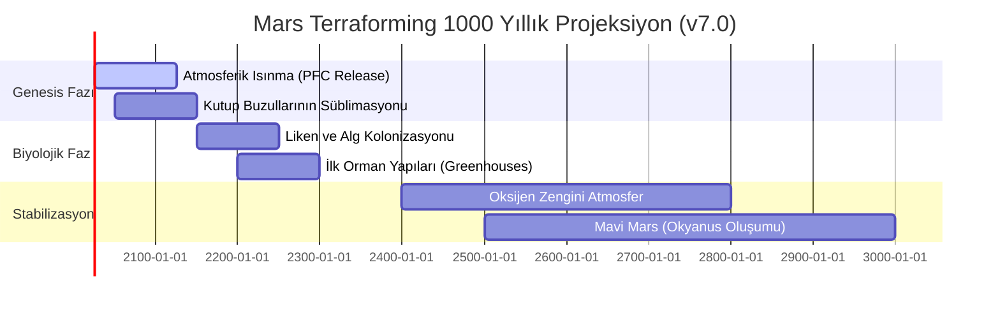

# ?? RedPlanet: Terraforming Genesis & Planetary Resilience Blueprint

## ?? Terraforming Genesis Vizyonu
**RedPlanet v7.0**, Mars'ı sadece otonom bir kamp yapmak yerine; onu yaşayan, nefes alan ve yeşil bir dünyaya dönüştürmenin mühendislik manifestosudur. Bu sürümle birlikte simülatör; Gezegensel Isınma, Mega-İnşaat Hub'ları ve Küresel Biosfer Takibi (Centennial Tracking) yeteneklerine kavuşmuştur.

---

## ?? Terraforming Operasyon Modülleri (v7.0)

### 1. Atmosferik Isınma (Greenhouse Induction)
ISRU tesisleri artık sadece yakıt değil, sera etkisi yaratacak **PFC (Perfluorocarbon)** gazları üretmek için optimize edilmiştir.
- **Isınma Katsayısı:** 1 kg PFC, ısı tutma kapasitesi bakımından 10.000 kg CO2'ye eşdeğerdir.
- **Model:** $\Delta T = \lambda \cdot \Delta F$ (Radiative forcing forcing $\Delta F \sim 0.25 \, W/m^2$ per GT).

### 2. Gezegensel İnşa Hub'ları (Construction Hubs)
Gezegensel projeler (Solar Mirror, Orbital Heater) için binlerce rover'ı koordine eden lojistik merkezler.
- **Hub Sinerjisi:** 5 km yarıçapındaki tüm roverlar için %5 verimlilik artışı ve otonom şarj imkanı.

### 3. Yüzyıllık Biyosfer Takibi (Centennial Tracker)
Simülatör, bir asır boyunca sürecek olan ısınma, basınç artışı ve "Habitability" endeksini takip eder.
- **Biyosfer Hedefi:** $T > 273K$ ve $P > 600hPa$ (Açık hava tarımı başlangıcı).

---

## ?? Terraforming Blueprint (1000 Yıllık Yol Haritası)

---

## ?? Teknik Mühendislik API Referansı

### `isru_simulator.atmospheric_warming`
- `calculate_pfc_effect`: Sera etkisi ve ısınma gradyanı hesabı.
- `optimize_warming_yield`: ISRU üretimini "Genesis" moduna yönlendirir.

### `swarm_construction.construction_hubs`
- `sync_swarm`: Gezegensel ölçekli inşa projelerinde düşük gecikmeli koordinasyon.
- `recharge_rover`: Mega-hub güç ünitelerinden enerji transferi.

---

## ?? Proje Final Notu
Bu proje, **TUA Astrohackathon** ve **Milli Uzay Programı** vizyonu çerçevesinde, Türkiye'nin Mars kolonizasyonundaki bilimsel ve teknolojik liderliğini sembolize etmek için tasarlanmıştır.

**Gelecek Gökte Değil, Mars'taki Otonom Sistemlerimizdedir.**
© 2026 RedPlanet Terraforming Commands. 
Güneş Sistemi'nin İlk Otonom Hükümeti Protokolü Uygulandı.