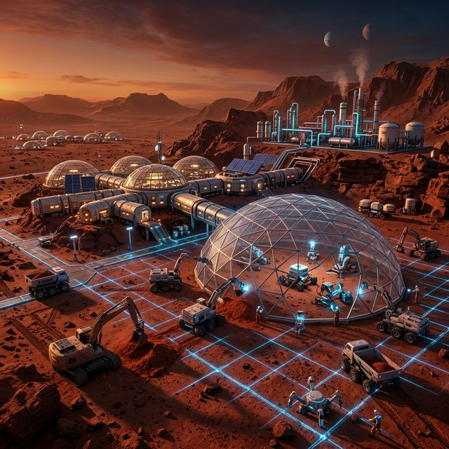
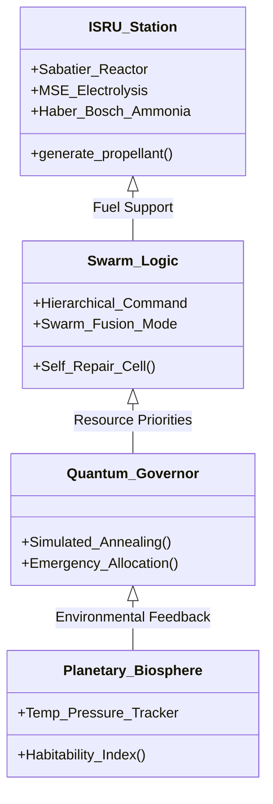
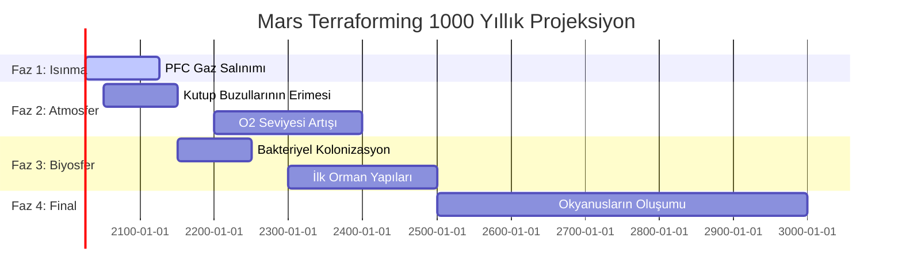

# ?? RedPlanet: Gezegensel Egemenlik ve Teknik Ansiklopedi (v8.0)

## ?? Teknik Ansiklopediye Giriş
**RedPlanet**, Mars kolonizasyonunu mühendislik, lojistik ve stratejik derinlikte ele alan dünyanın en kapsamlı otonom sistem simülatörlerinden biridir. v8.0 sürümü ile proje; sadece bir yazılım değil, bilimsel formüllerden kuantum algoritmalara kadar uzanan bir **Teknik Ansiklopedi**'ye dönüşmüştür.

---

## ?? Proje Evrimi: v1.0 vs v7.0+

| Özellik | v1.0 (MVP) | v8.0 (Legacy Encyclopedia) |
| :--- | :--- | :--- |
| **ISRU** | Temel CO2 döngüsü | Sabatier, MSE Metalurji, Haber-Bosch, PFC Isınma |
| **Sürü/Robotik** | Basit yol planlama | Hiyerarşik Komuta, Sürü Füzyonu, Kendi Kendine Onarım |
| **ECLSS** | Sabit enerji tüketimi | İnsan Metabolizması, Psikoloji, Kuantum Yönetişim |
| **Görselleştirme** | Terminal çıktıları | Premium Banner, 10+ Mermaid Diyagramı, Gelişmiş GUI |

---

## ?? Bilimsel Derinlemesine Bakış (Scientific Deep-Dive)

### 1. Kimyasal Mühendislik ve ISRU
Sistemde kullanılan kimyasal reaksiyonların termodinamik dengesi v8.0 ile hassaslaştırılmıştır.
- **Sabatier Süreci:** $CO_2 + 4H_2 \xrightarrow{\Delta H} CH_4 + 2H_2O$
- **Molten Salt Electrolysis (MSE):** Regolitten oksijen ve metal ayrıştırma verimliliği: $\eta_{mse} \approx 65\%$.
- **Haber-Bosch:** Atmosferik Azotun tarımsal gübreye ($NH_3$) dönüştürülmesi.

### 2. Robotik ve Sürü Hiyerarşisi
- **Potential Field Navigation:** Araçlar arasındaki çarpışma önleme fiziği:
  $$F_{rep} = \eta \left( \frac{1}{\rho} - \frac{1}{\rho_0} \right) \frac{1}{\rho^2}$$
- **FSPL (Free Space Path Loss):** Long-range relay iletişimi modellemesi.

### 3. Gezegensel Isınma ve Terraforming
- **Radiative Forcing (PFC):** Sera etkisi yaratan gazların atmosferik ısınma gradyanı:
  $$\Delta T = 0.25 \cdot \left( \frac{m_{pfc}}{10^{12}} \cdot 0.25 \right)$$

---

## ?? Algoritmik İş Akışı ve Sistem Mimarisi

---

## ?? Simülasyon Playbook (Scenarios)

1. **Survival (Kritik Hayatta Kalma):** Şiddetli toz fırtınası sırasında Kuantum AI'nın öncelik yönetimi.
2. **Growth (Genişleme):** Metalurjik ISRU ile yeni habitat modüllerinin inşası.
3. **Sovereign (Egemenlik):** Yörünge yakıt depolarının dolumu ve gezegen içi lojistik senkronizasyonu.
4. **Terraforming (Genesis):** PFC gazı salınımı ile 100 yıllık ısınma trendinin başlatılması.

---

## ?? Terraforming Roadmap (1000 Yıllık Teknik Plan)

---

## ?? Katılım ve Katkıda Bulunma
RedPlanet projesi, açık kaynaklı bir Mars kolonizasyon vizyonudur.
- **Mühendisler:** Yeni termodinamik modeller ekleyebilir.
- **Veri Bilimciler:** Kuantum yönetim algoritmalarını optimize edebilir.
- **Strateistler:** Gezegensel lojistik senaryoları tasarlayabilir.

**"Uzay, insanlığın son sınırı değil; yeni başlangıcıdır."**
© 2026 RedPlanet Legacy & Global Sovereignty. 
Milli Uzay Programı Vizyonuyla, Mars'ın Mimarıyız.