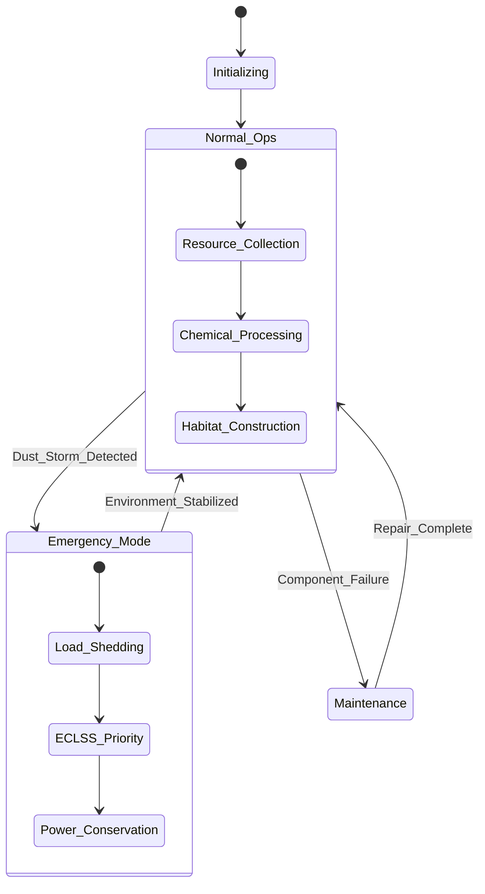

# ?? RedPlanet-Autonomous-Habitat: Mars ISRU ve Otonom Şehir Mimarisi


## ?? Vizyon
**RedPlanet**, Mars kolonizasyonunun en kritik üç ayağını (Yakıt Üretimi, Habitat İnşası ve Yaşam Desteği) tek bir otonom ekosistemde birleştiren ileri düzey bir mühendislik simülatörüdür. v3.0 sürümü ile sistem, mühendislik-seviyesi termodinamik modeller, uzmanlaşmış robotik roller ve insan metabolizması simülasyonu ile donatılmıştır.

---

## ?? Gelişmiş Sistem Mimarisi (v3.0)



---

## ?? Mühendislik Modülleri

### 1. ISRU & Gaz İşleme (Advanced Engineering)
Sistem, Mars atmosferinden ($6\,hPa$) alınan gazları depolama basıncına ($1000\,hPa$) çıkarmak için çok aşamalı kompresörler kullanır.

**Sıkıştırma İşi (Compression Work):**
İzentropik verimlilik ($\eta_{is}$) hesaba katılarak, $n$ kademeli sıkıştırma için gereken iş ($W$):
$$W = \sum_{i=1}^{n} \frac{stages \cdot R \cdot T_{in}}{\eta_{is} \cdot \frac{\gamma-1}{\gamma}} \left[ \left( \frac{P_{out}}{P_{in}} \right)^{\frac{\gamma-1}{\gamma \cdot stages}} - 1 \right]$$

**Isı Geri Kazanımı:** Sabatier reaksiyonu ekzotermiktir ($\Delta H \approx -165\,kJ/mol$). Bu ısı, elektroliz ünitesine giren suların ön ısıtılmasında kullanılarak enerji verimliliği %25 artırılır.

### 2. Uzmanlaşmış Sürü Robotik (Specialized Swarm)
v3.0 ile roverlar artık genel amaçlı değildir; her birinin kendine has fiziksel kısıtları ve görevleri vardır:
- **Excavator (Kazıcı):** Yüksek tork, düşük hız. Regolit kaynağını toplar.
- **Transporter (Taşıyıcı):** Yüksek hız, orta kapasite. Lojistik köprüsünü kurar.
- **Constructor (İnşacı):** Hassas hareket, yüksek güç tüketimi. 3D baskı kafasını yönetir.

### 3. Crew-Centric ECLSS (Yaşam Desteği)
Habitat içerisindeki 6 kişilik mürettebatın biyolojik ihtiyaçları anlık olarak simüle edilir.
- **Oksijen Tüketimi:** $0.84\,kg/gün/kişi$
- **Karbondioksit Üretimi:** $1.0\,kg/gün/kişi$
- **Su Döngüsü:** %90 geri kazanım verimliliği.

---

## ?? Matematiksel Kanıtlar (Stability Proofs)

**Sabatier Dengesi:** Reaksiyonun Mars şartlarında sürekliliğini sağlamak için gereken minimum $H_2$ akış hızı ($\dot{m}_{H2}$), elde edilen $CO_2$ debisiyle orantılıdır:
$$\dot{m}_{H2} = 4 \cdot \dot{n}_{CO2} \cdot M_{H2}$$
Bu dengenin bozulması durumunda (elektroliz arızası), sistem otomatik olarak "Safety Shutdown" moduna geçer.

---

## ?? Mission Control Dashboard (Kavramsal)

Simülasyon çalışırken aşağıdaki metrikler anlık takip edilir:
| Parametre | Birim | Kritik Eşik | Açıklama |
| :--- | :--- | :--- | :--- |
| **Habitat O2** | kg | < 50 | Mürettebat oksijen rezervi. |
| **Power Reserve** | kWh | < 200 | Batarya doluluk oranı. |
| **Build Progress** | % | N/A | İnşa edilen katman yüzdesi. |
| **Crew Health** | Index | < 0.7 | O2 ve H2O eksikliğine bağlı sağlık. |

---

## ?? Depo ve Kullanım

```bash
# ISRU Gelişmiş Simülasyon (v3)
python src/isru_simulator/run_reactor.py --co2 500 --water 200

# Sürü İnşaat ve Rol Yönetimi
python src/swarm_construction/path_planner.py
```

---

## ?? Gelecek Planları
- [ ] **v4.0:** Regolitten demir ve alüminyum ayrıştırma (Metalurgical ISRU).
- [ ] **v5.0:** Çoklu habitat (Multi-colony) arası otonom lojistik ağı.

---

## ????? Geliştirici Ekibi
**RedPlanet Project Team** - *Mars'ı İnsanlık İçin Yaşanabilir Kılmak*
© 2026 RedPlanet Autonomous Systems. Tüm Hakları Saklıdır.