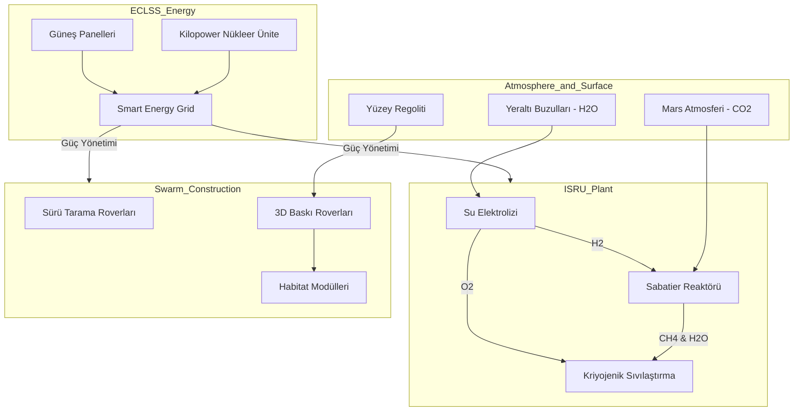

# ?? RedPlanet-Autonomous-Habitat: Mars ISRU ve Otonom Şehir Mimarisi


## ?? Yüksek Düzey Özet
**RedPlanet-Autonomous-Habitat**, Mars yüzeyinde kurulacak insanlı bir üssün Dünya'ya olan lojistik bağımlılığını ortadan kaldırmak üzere tasarlanmış uçtan uca bir sistem mimarisidir. 

Sistem, Mars'ın atmosferik ve yüzey kaynaklarını (ISRU) kullanarak roket yakıtı, oksijen ve su üreten **Endüstriyel Kimyasal Tesis** ile; Mars regolitini işleyerek radyasyon kalkanlı modüller inşa eden **Otonom Sürü Robotik** (Swarm Robotics) sistemini tam entegre çalıştırır.

---

## ?? Sistem Mimarisi (System Architecture)



---

## ?? Kimyasal Süreç ve Termodinamik (ISRU)

Sistem, Mars'ta kendi kendini idame ettirebilmek için uluşlararası NASA ve SpaceX modelleriyle uyumlu bir kimyasal döngü kullanır.

### 1. Su Elektrolizi
Yeraltından çıkarılan suların ayrıştırılmasıyla yakıt ve yaşam desteği için hammadde sağlanır:
$$2H_2O_{(l)} + Enerji \rightarrow 2H_{2(g)} + O_{2(g)}$$

### 2. Sabatier Reaksiyonu
Mars atmosferindeki $CO_2$ ve elektrolizden gelen $H_2$ bir katalizör (genellikle Nikel veya Ruthenyum) eşliğinde reaksiyona sokularak metan yakıtı elde edilir:
$$CO_2 + 4H_2 \xrightarrow{400^\circ C} CH_4 + 2H_2O$$

### 3. Kriyojenik Depolama (Liquefaction)
Üretilen gazların roket yakıtı olarak kullanılabilmesi için sıvılaştırılması gerekir. Sıvılaştırma için gereken enerji, gazın kütlesi ($m$), özgül ısısı ($C_p$), sıcaklık farkı ($\Delta T$) ve buharlaşma gizli ısısı ($L$) ile hesaplanır:
$$Q = m \cdot C_p \cdot \Delta T + m \cdot L$$

---

## ?? Sürü Robotik ve Habitat İnşası (Swarm Construction)

Otonom roverlar, "Sürü Zekası" (Swarm Intelligence) algoritmalarını kullanarak birbirleriyle çarpışmadan, belirlenen inşa alanına regoliti katmanlar halinde serer.

**Özellikler:**
- **3D Grid-Based Building:** İnşa alanı, her bir hücresi (voxel) regolit katmanını temsil eden 3 boyutlu bir matris olarak modellenir.
- **Dinamik Yol Planlama:** Roverlar, inşaat ilerledikçe değişen topografyaya göre yollarını gerçek zamanlı günceller.
- **Radyasyon Kalkanı:** Hedef, yaşam modülleri üzerine en az 2-5 metre kalınlığında regolit tabakası sererek kozmik radyasyonu %99 oranında azaltmaktır.

---

## ?? Akıllı Enerji Yönetimi (ECLSS)

Mars'ın mevsimsel döngüsü ve toz fırtınaları enerji üretimini kritik seviyelere düşürebilir.

### Mevsimsel Güneş Akısı (Solar Flux) Calculations
Mars'ın yörünge eksantrisitesi ($e=0.0934$) nedeniyle Güneş'e uzaklığı değişkendir. Günlük radyasyon akısı ($F$) şu şekilde hesaplanır:
$$F = F_{avg} \cdot \left( \frac{r_{avg}}{r} \right)^2$$
Burada $r$, solar boylam ($\mathcal{L}_s$) değerine göre hesaplanan yörünge uzaklığıdır.

### Dinamik Yük Atma (Load Shedding)
Enerji seviyesi kritik eşiğin altına indiğinde, sistem düşük öncelikli yükleri (Örn: İnşaat, Fabrika) otomatik olarak kapatır ve yaşam desteğini (ECLSS) korur.

---

## ?? Depo Yapısı (Repository Structure)

```text
RedPlanet-Autonomous-Habitat/
├── docs/                   # PDF raporlar ve teknik çizimler
├── src/
│   ├── isru_simulator/     # Kimyasal reaksiyon ve sıvılaştırma modelleri
│   ├── swarm_construction/ # Sürü zekası ve 3D grid inşa algoritmaları
│   └── eclss_energy_manager/ # Akıllı şebeke ve hava durumu simülatörü
├── notebooks/              # Analiz ve görselleştirme (Jupyter)
├── requirements.txt        # Gerekli kütüphaneler (numpy, matplotlib, etc.)
└── README.md
```

---

## ?? Kurulum ve Kullanım

### 1. Gereksinimler
- Python 3.8+
- numpy, matplotlib

```bash
pip install -r requirements.txt
```

### 2. ISRU Simülasyonunu Çalıştırma
```bash
python src/isru_simulator/run_reactor.py --co2 100 --water 50
```

### 3. Sürü İnşaat Simülasyonunu Çalıştırma
```bash
python src/swarm_construction/path_planner.py
```

---

## ?? Teknik Yol Haritası (Roadmap)

- [ ] **v1.5:** Haberleşme Gecikmesi (Latency) simülasyonunun eklenmesi.
- [ ] **v2.0:** Gaz fazı ayrıştırma (Vapor-Liquid Equilibrium) modellerinin ISRU tesisine entegrasyonu.
- [ ] **v3.0:** Unity veya Unreal Engine üzerinde 3D görselleştirme modülü.

---

## ????? Sistem Mimarı
**RedPlanet Project Team** - *Mars'ı İnsanlık İçin Yaşanabilir Kılmak*
Tasarım ve Geliştirme: Multi-Disciplinary AI & Space Systems Engineering