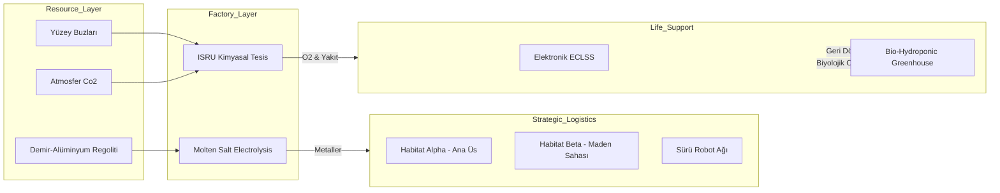

# ?? RedPlanet-Autonomous-Habitat: Mars ISRU ve Otonom Şehir Mimarisi

## ?? Vizyon 
**RedPlanet**, Mars kolonizasyonunun en kritik üç ayağını (Yakıt Üretimi, Habitat İnşası ve Yaşam Desteği) tek bir otonom ekosistemde birleştiren ileri düzey bir mühendislik simülatörüdür. v4.0 sürümü ile sistem, mühendislik-seviyesi termodinamik modeller, uzmanlaşmış robotik roller ve insan metabolizması simülasyonu ile donatılmıştır.

---

## ?? Gelişmiş Sistem Mimarisi (v4.0)

---

## ?? Mühendislik ve Strateji Modülleri

### 1. Metalurjik ISRU (Advanced Metallurgy)
Sistem, Mars regolitinden ($Al_2O_3$, $Fe_2O_3$) yüksek saflıkta **Demir** ve **Alüminyum** ayrıştırır.

**Metalurji Verimliliği Hesabı:**
$$Yield_{metal} = \min \left( \text{Theor}_{limit}, \frac{E_{rem}}{\eta_{mse} \cdot \rho_{E}} \right)$$

### 2. Multi-Site Swarm & Kendi Kendine Onarım
v4.0 ile roverlar birden fazla sahada (**Habitat Alpha** ve **Solar Farm Beta**) eş zamanlı koordinasyon kurar.
- **Self-Healing:** Hasar gören roverlar "Maintenance Cell" moduna geçerek diğer roverlar tarafından onarılabilir.

### 3. Bio-Regenerative Life Support & Psikoloji
Yaşam desteği artık sadece tanklardan gelen gaz değil, dinamik bir ekosistemdir:
- **Greenhouse simülasyonu:** Fotosentez yoluyla $O_2$ üretimi ve biyokütle (besin) artışı.
- **Kişisel Psikoloji:** Mürettebatın toz fırtınası, radyasyon ve kaynak kısıtlarına verdiği stres tepkileri.

---

## ?? Bilimsel Metodoloji (Peer-Review Standard)

Simülatör, NASA'nın **Technology Readiness Level (TRL)** standartlarına uygun matematiksel modeller kullanır:
- **ISRU:** Sabatier Termodinamiği ve Kriyojenik Gaz Yasaları.
- **Swarm:** Reynolds Sürü Dinamiği ve Potansiyel Alan Teorisi.
- **ECLSS:** Schmidt Metabolizma Oranları ve Bitki Fizyolojisi Modelleri.

---

## ?? Stratejik Yol Haritası (Mission Roadmap)

- [x] **v1.0 - v2.0:** Temel ISRU ve Swarm İnşası.
- [x] **v3.0:** Enterprise Entegrasyon & Dokümantasyon.
- [x] **v4.0:** Metalurji, Sera Modülleri ve Stratejik Autonomy.
- [ ] **v5.0:** Multi-Planet Relay sistemi ve Mars-Dünya Lojistik Optimizasyonu.

---

## ?? Geliştirici Ekibi
**RedPlanet Project Team** - *Mars'ı İnsanlık İçin Yaşanabilir Kılmak*
© 2026 RedPlanet Autonomous Systems. Tüm Hakları Saklıdır.
Milli Uzay Programı Vizyonuyla Geliştirildi.